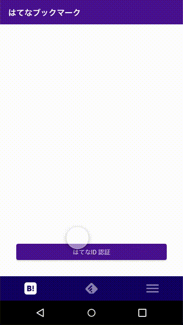

エンジニアでも出来るAdobeXDでプロトタイピング
-----

# なぜプロトタイピングが必要なのか？
スクラムを導入した際にプロダクトオーナーとエンジニア間で機能の必要性に関して揉めることが多々あるのではないでしょうか。
なぜそのような状況になるのか見てみると、**「その機能が必要とされているという確証を得ていない」**ことが多いと思います。

**「自分はこれが必要だと思う」****「いや自分はこっちのほうがいいと思う」**といった発言は主観的な判断になりやすく、**「客観的に見てユーザーが必要としているか」**という判断が漏れてしまいます。
では、どうすれば**「客観的に見てユーザーが必要としているか確証を得る」**ことが出来るのでしょうか？

１つの方法として**「仮説を検証する」**があるのではないでしょうか？
**「ユーザーがXXXをしたいと考えているはずだ」**という仮設を立て、何かしらの手段で**「ユーザーはXXXをしたいと考えていた」**という情報を得ることができれば、
**「客観的に見てユーザーが必要としているか確証を得る」**ことが出来るはずです。

**「仮説を検証する」**方法としてまず考えられるのは、**「実装した機能を使ってもらう」**があるでしょう。
この場合、スクラムなどのイテレーションで実装していくスタイルの手法を取り入れることで実現できるはずです。
しかし、実装するのにそれなりのコストがかかりますし、実装した後に変更するコストも決して低くはなく、現実的には厳しいものがあると思います。。。

どうすれば、コスパよく**「仮説を検証する」**ことが出来るのか考えてみると、**「プロトタイプを作る」**という考えがあります。
最近ではいくつかのプロトタイピングツールがあり、それらを使うことによって**「低コスト」**で**「仮説を検証する」**ことが出来るはずです。

そこで、今回はプロトタイピングツールの１つである**「AdobeXD」**を使ってみたいと思います。

# AdobeXD
```
Adobe XDは、共同作業を促進するパワフルで使いやすいプラットフォーム。
webサイトやモバイルアプリ、音声インターフェイス、ゲームなどのデザイン制作をチーム全体でスムーズにおこなうことができます。 
```

# プロトタイプを作ってみた

自分用に作っているアプリのプロトタイプをAdobeXDを使って作ってみました。

特別なスキルは必要なく、チュートリアルの動画を幾つか見ただけで作ることが出来る使いやすさです。

デザイン画面


プロトタイプ画面




また、デザインレビュー機能があったり、実装する際に必要なスタイル詳細を共有できたり、svgなどのアセットも自動で共有できたりと
プロダクト開発チームで使うための機能が一通りそろっています。


# 良かった点・悪かった点
良かった点

- 簡単に使える
- 動作が軽い
- コンポーネント機能で管理が楽にできる
- 実機でプロトタイプを動かせる
- リアルタイムに変更内容をプロトタイプに反映できる
- チーム開発用の機能が揃っている
- 履歴機能がある

悪かった点

- コンポーネントの変更が少しやりづらい
- バージョン管理が少しやりづらそうな感じ
- 共有機能を使った場合に、コンポーネント名が確認できなくなってしまう

# まとめ
- **「客観的に見てユーザーが必要としているか確証を得る」**手段として**「仮説を検証する」**がある
- **「仮説を検証する」**ために**「実装した機能を使ってもらう」**にはコストが高すぎる
- コスパよく**「仮説を検証する」**ために**「プロトタイプを作る」**ことが出来る
- **「プロトタイプを作る」**ためのツールとして**「AdobeXD」**を使ってみた
- **「AdobeXD」**は**「特別なスキルは不要で誰でも簡単に使える」**し**「チーム開発に必要な機能が揃っている」**

# 感想
- チームの共通言語として**「AdobeXD」**を使うと良さそう
- **「Prott」****「Figma」**などとも比較してみたい

# 参考資料
- [Adobe XD体験版ダウンロード | UI/UXデザインと共同作業ツール](https://www.adobe.com/jp/products/xd.html)