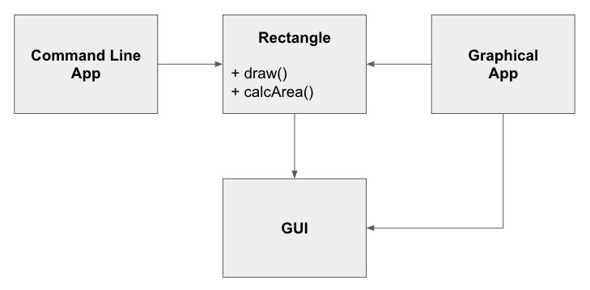
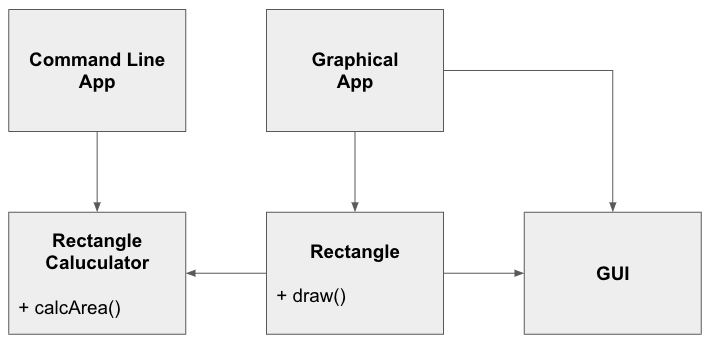
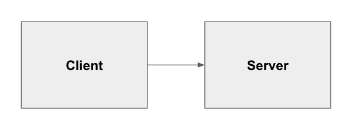
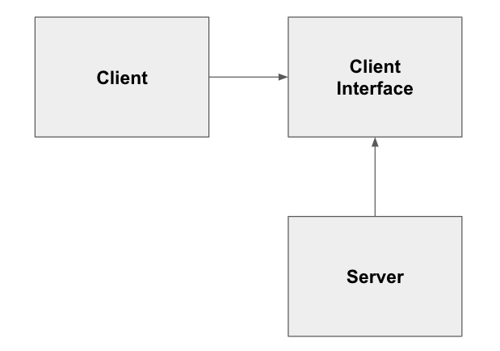
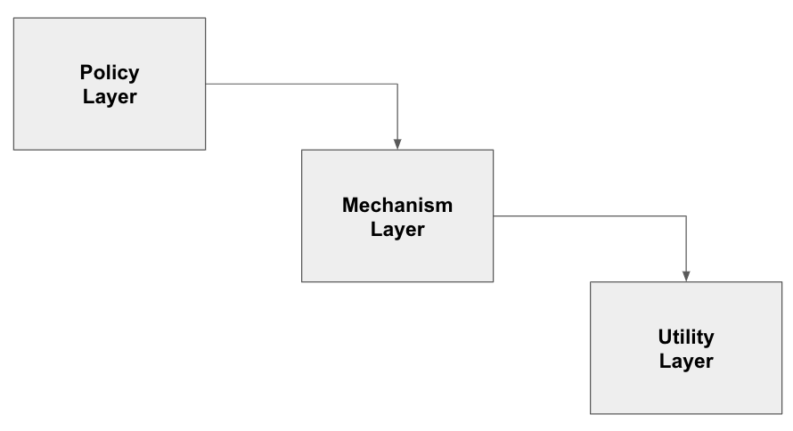
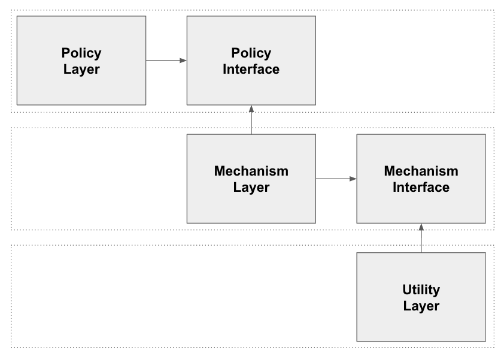

SOLID原則
-----

ソフトウェア設計をより理解しやすく、柔軟で、メンテナンスしやすくする為の５つの原則である。

`SOLID`とは以下の５つの原則の頭文字を取ったものである。
- Single Responsibility Principle | 単一責任の原則
- Open Closed Principle | オープン・クローズドの原則
- Liskov Substitution Principle | リスコフの置換原則
- Dependency Inversion Principle | 依存関係逆転の法則
- Interface Segregation Principle | インターフェース分離の原則

# Single Responsibility Principle | 単一責任の原則
クラスを変更する理由は１つ以上存在してはならない。

## 概要
１つのクラスは１つの役割（＝変更理由）だけ持つべきである。  
複数の役割を持っていると、何かを変更した際にそのクラスが持っている他の役割にも影響を与えてしまう可能性があるので良くない。

## 悪い例
Rectangleクラスが数学的な値の計算と図形の描画という２つの役割を持ってしまっている。

## 改善例

# Open Closed Principle | オープン・クローズドの原則
ソフトウェアの構成要素（クラス、モジュール、関数など）は拡張に対して開いていて、修正に対して閉じていなければならない。

## 概要
アプリケーションの仕様が変更されても新たな振る舞いを追加すれば対処できて、既存のソースコードは影響が出ないようにするべきである。  
容易に機能を追加でき、既存のコードを修正する必要性がない状態。

## 悪い例
ClientクラスはServerクラスを利用しているので、Clientオブジェクトが別のServerオブジェクトを利用する場合は、Clientクラスを変更する必要がある。

## 改善例
Interfaceに依存している場合は、Clientオブジェクトが別のServerクラスを使いたくなったら、Client Interfaceの派生クラスを追加すればよい。

# Liskov Substitution Principle | リスコフの置換原則
派生型はその基本形と置換可能でなければならない。

## 概要
基底クラスのオブジェクトを使った処理があり、派生クラスのオブジェクトと入れ替えても同様に動作するべきである。  
派生クラスは基底クラスの振る舞いに影響を与えるべきではない。

# Dependency Inversion Principle | 依存関係逆転の法則
a. 上位のモジュールは下位のモジュールに依存してはならいない。どちらのモジュールも「抽象」に依存すべきである。  
b. 「抽象」は実装の詳細に依存してはならない。実装の詳細が「抽象」に依存すべきである。

## 概要
下位モジュールは上位モジュールの方針に従うべきであり、各モジュールは抽象に依存するべきである。  
上位モジュールが下位モジュールに依存すると、下位モジュールの変更が上位モジュールに影響を与えてしまうことになる。

## 悪い例

## 改善例

# Interface Segregation Principle | インターフェース分離の
クライアントに、クライアントが利用しないメソッドへの依存を強制してはならない。

## 概要
必要のないメソッドに依存してしまうと不用意に変更の影響を受けやすくなってしまう。  
そういった影響を避けるために、インターフェースは分離しておくべきである。

# 参考文献
- http://butunclebob.com/ArticleS.UncleBob.PrinciplesOfOod
- https://en.wikipedia.org/wiki/SOLID
- アジャイルソフトウェア開発の奥義 第2版
