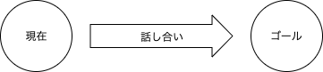
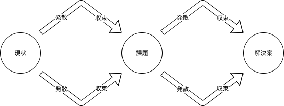

会議ファシリテーションでスクラムの価値を引き出す
-----

最近ではソフトウェア開発手法として、スクラムを採用している方々も多いのではないでしょうか。

さて、「スクラムガイド」では4つのイベントが定義されていて、
スプリント期間が1週間であれば、だいたい以下のような時間配分になるのではないでしょうか？

- 120分：スプリントプランニング
- 75分：デイリースクラム（15分/1日）
- 60分：スプリントレビュー
- 60分：スプリントレトロスペクティブ

この場合、「毎週315分」をイベントという名の会議に使っていて、
「労働時間の13％」に相当することになるのです。（週40時間労働の場合）

これらはスクラムで重要な要素となっている「透明性」「検査」「適応」を実現するために用意された必要最低限のイベントとなっていて、
基本的にはイベントを省略することは推奨されていないと思います。

つまり、**スクラムでは「労働時間の13％」をイベント（会議）に使い「透明性」「検査」「適応」を実現する仕組みを提供している**のです。
スクラムの価値を引き出すためにはこれらのイベントの効果を高めることが必要なのではないでしょうか？

そこで今回は、スクラムの価値を引き出すために、誰でもできる「会議ファシリテーション」に関する情報を整理したいと思います。


# 会議ファシリテーションとは？
「ファシリテーション」の意味を辞書で調べてみると、以下となっています。
```
グループによる活動が円滑に行われるように支援すること。
特に、組織が目標を達成するために、問題解決・合意形成・学習などを支援し促進すること。
また、そのための方法。
```
つまり、「会議ファシリテーション」とは「会議が円滑に行われるように支援すること」となるでしょう。


# 会議とは？
「会議」の意味を辞書で調べてみると、以下となっています。
```
① 関係者が集まり、討論・相談や決議をすること。また、その会合。 「編集－」 「対策－」 「 －室」
② 一定の事柄を相談し決定するための機関。 「日本学術－」
```
砕けた言い回しをすると「みんなで話し合ってゴールに到達する」ことではないでしょうか？




# スキル不要で始める会議ファシリテーション
**「会議ファシリテーション」は特別なスキルを持っていなくても実践することができます。**

今回は以下の5つの項目を紹介したいと思います。

1. 終了条件を確認する
2. 時間配分を確認する
3. 決まったこと・やるべきことを確認する
4. 事前に確認する
5. 発散と収束を区別する

### 終了条件を確認する
会議とは「みんなで話し合ってゴールに到達する」ですので、会議の一番最初に「ゴールに到達したと判断できる条件」の認識をあわせましょう。
これにより、会議は終了したけど何も決まっていない状態になるリスクを低減できます。

e.g.

- 次のスプリントで対応するチケットに見積もりがついている状態
- 次のスプリントで対応するチケットに受け入れ条件が記載されている状態
- 次のスプリントで対応するチケットの優先順位が決まっている

tips

- 終了条件はできる限り明確に判断できるものにすると、認識の齟齬が少なくなるでしょう
- 常に終了条件が見えるようにホワイトボードに書いておくと意識しやすいでしょう

### 時間配分を確認する
「ゴールに到達する」方法は1つだけでは無いはずです、今回の会議ではどのような時間配分・アジェンダで勧めていくのか会議の一番最初に認識合わせをしましょう。
これにより、議論がそれてしまうリスクを低減できます。

e.g.

- 5分：現在のベロシティを確認
- 30分：次のスプリントで着手できそうなチケットに見積もり・受け入れ条件を記載する
- 10分：次のスプリントで着手できそうなチケットの優先順位を更新する

tips

- 常に時間配分が見えるようにホワイトボードに書いておくと意識しやすいでしょう

### 決まったこと・やるべきことを確認する
多くの場合、会議を行ったことで「決まったこと」や「やるべきこと」が出てくると思います。必ず会議の最後に改めて認識合わせをしましょう。
これにより、「決まったことが」が守られなかったり、「やるべきこと」が実施されないリスクを低減できます。

e.g.

- 決まったこと
  - ○○○のチケットは△△△なので次のスプリントでは対応しない
- やるべきこと
  - ○○○のチケットが△△△である理由を□□□さんに確認しチームに共有する
    - 担当：Aさん
    - 期限：XX月YY日

tips

- 実行可能なアクションである場合は、「誰が」・「いつまでに」行うのか確認すると良いでしょう

### 事前に確認する
時間は有限ですし、会議の進め方によっては準備が必要となる場合もあるでしょう。「終了条件」や「時間配分」を事前に確認し会議の準備をしましょう。
これにより、議論以外のことに時間を費やしてしまったり、情報が足りなくて決められないといったリスクを低減できます。

e.g.

- 終了条件
  - 次のスプリントで対応するチケットに見積もりがついている状態
  - 次のスプリントで対応するチケットに受け入れ条件が記載されている状態
  - 次のスプリントで対応するチケットの優先順位が決まっている
- 時間配分
  - 5分：現在のベロシティを確認
  - 30分：次のスプリントで着手できそうなチケットに見積もり・受け入れ条件を記載する
  - 10分：次のスプリントで着手できそうなチケットの優先順位を更新する
- 事前準備
  - ○○○のチケットが△△△である理由を□□□さんに確認しておく
    - 担当：Aさん

### 発散と収束を区別する
「現状」や「課題」に対して「方針」や「解決策」を決める場合、それぞれに対して「発散」し「収束」する流れを経る必要があります。
「発散」と「収束」を区別し順番に議論を進めていきましょう。
これにより、論点が行ったり来たりしてしまうリスクを低減できます。

e.g.

- 「発散：現状の課題を確認」→「収束：議論する課題を選択」→「発散：課題に対する解決案を議論」→「収束：実行する解決案を選択」

tips

- 時間配分を決める際に発散と収束を区別すると良いでしょう




# まとめ
スクラムでは「労働時間の13％」をイベント（会議）に使い「透明性」「検査」「適応」を実現する仕組みを提供しています。
それらのイベント（会議）の効果を高めるには「会議ファシリテーション」が有効です。

「会議ファシリテーション」は決して難しいものではなく、スキル不要で始められるものも多くあります。
なので、スクラムを採用している方々には「会議ファシリテーション」を使って、スクラムの価値を最大限引き出してほしいなと思います。


# 参考資料
1. [The Scrum Guide](https://www.scrumguides.org/docs/scrumguide/v2017/2017-Scrum-Guide-Japanese.pdf)
2. [ファシリテーションとは何？ Weblio辞書](https://www.weblio.jp/content/%E3%83%95%E3%82%A1%E3%82%B7%E3%83%AA%E3%83%86%E3%83%BC%E3%82%B7%E3%83%A7%E3%83%B3)
3. [会議(かいぎ)の著者・刊行日 Weblio辞書](https://www.weblio.jp/content/%E4%BC%9A%E8%AD%B0)
4. [世界で一番やさしい会議の教科書 | 榊巻 亮 |本 | 通販 | Amazon](https://www.amazon.co.jp/dp/4822271781)
